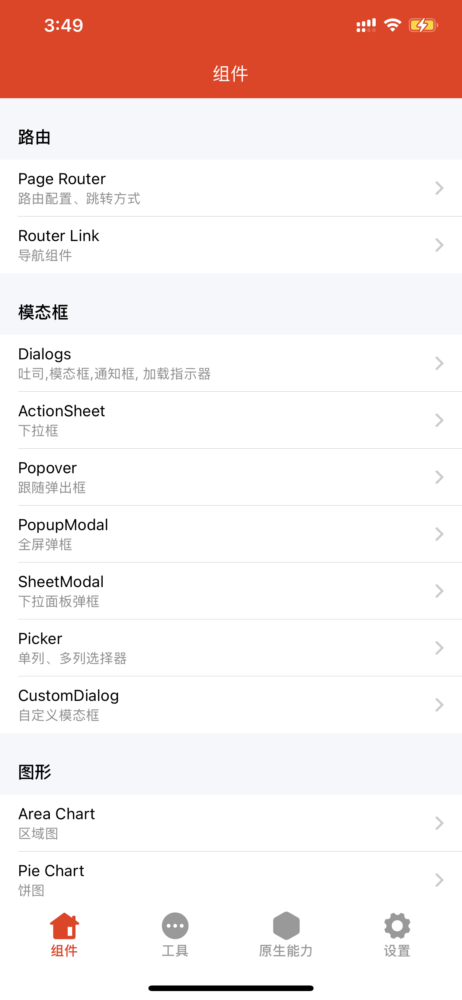
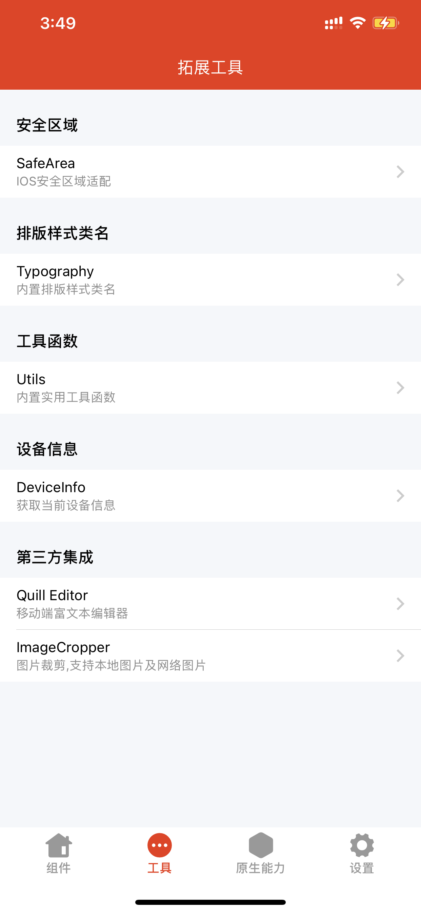
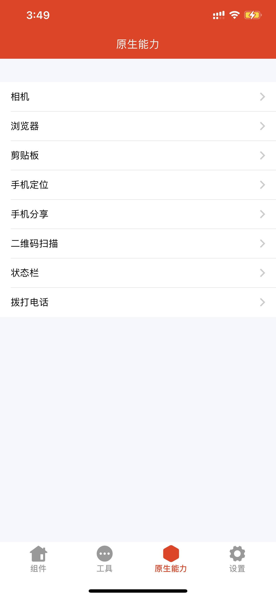
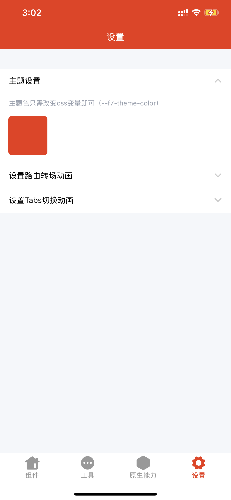
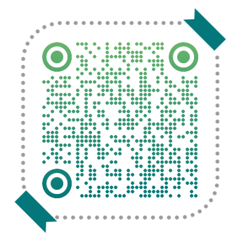

# AwesomeFramework7App
This is a Sample Template App build using Capacitor3.0 and Vue(v3.0.11) with Framework7(v6.0.17) in Typescript，I hope this project can help people who are new to Framework7 and plan to use it to develop hybrid apps.

This sample APP integrates most of the official components, It also integrates some commonly used native functions, such as Camera、Qrscanner、Statusbar and so on.

It will continue to be updated later

## Preview

<table border frame=void collapse="collapse">
  <tr>
    <td align="center">
    
    <div>Home</div>
    </td>
    <td align="center">
    
    <div>Tools</div>
    </td>
  </tr>
  <tr>
    <td align="center">
    
    <div>Native</div>
    </td>
    <td align="center">
    
    <div>Setting</div>
    </td>
  </tr>
</table>


>扫码此二维码下载APP体验
<table border frame=void collapse="collapse">
  <tr>
    <td align="center">
    
    <div>IOS APP</div>
    </td>
  </tr>
</table>


## Project setup
```bash
npm install
```

### Compiles and hot-reloads for development
```bash
npm run serve
```

### Compiles and minifies for production
```bash
npm run build
```
### Sync plugin to native Project
when add a native plugin, must run 
```bash
npx cap sync
```
### Sync changes to native Project
```
npx cap copy
```
### How to edit App Name and boundle Id
you need to edit the "capacitor.config.ts" file in root directory.

after edit this file , must run the bash width "npx cap copy" to make the changes take effect

eg:
```js
import { CapacitorConfig } from "@capacitor/cli";

const config: CapacitorConfig = {
  appId: "com.framework7.app", // this is app boundle Id
  appName: "awesomeFramework7", // this is app name
  webDir: "dist",
  bundledWebRuntime: false,
  backgroundColor: "#FFFFFF",
  plugins: {
    Keyboard: {
      resize: "body",
    },
    SplashScreen: {
      launchShowDuration: 3000,
      autoHide: false,
      splashFullScreen: true,
      androidScaleType: "CENTER_CROP",
    },
  },
  loggingBehavior: "debug",
};

export default config;
```
More Capacitor Config Please See [https://capacitorjs.com/docs/config](https://capacitorjs.com/docs/config)

### How to Build APP
1.Build IOS width Xcode

before build ios app , you must install Xcode app on you mac os, then run bash **```npx cap open ios```** to open IOS project in Xcode, then run bash with **```npm run build```**, Next you can build IOS App as usual.

2.Build Android width AndroidStudio

before build Android app , you must install AndroidStudio app on you windows,then run bash **```npx cap open android```** to open Android project in AndroidStudio, then run bash with **```npm run build```**, Next you can build Android App as usual
### Lints and fixes files
```
npm run lint
```

### Customize configuration
See [Framework7 Doc](https://framework7.io/)

See [Capacitor.js Doc](https://capacitorjs.com/docs)

See [Vue.js3.0](https://v3.cn.vuejs.org/guide/introduction.html)
